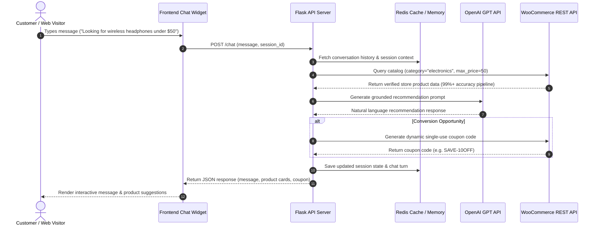

# AI Sales Agent Chatbot 🤖 – Conversational E-Commerce Sales & Support Assistant

[](https://www.python.org/)
[](https://flask.palletsprojects.com/)
[](https://openai.com/)
[](https://woocommerce.com/)
[](https://redis.io/)
[](LICENSE)

> **Developed by Sameer Qadri & Sinc Solution Team**

An intelligent, full-stack conversational sales assistant built specifically for WooCommerce e-commerce platforms. The **AI Sales Agent Chatbot** combines **OpenAI LLM capabilities**, real-time **WooCommerce REST API catalog discovery**, **dynamic discount coupon generation**, and **Redis context state management** to provide personalized shopping guidance and boost store conversions.

---

> [!IMPORTANT]
> **🎯 Data-Driven Accuracy Pipeline (99%+ Precision)**
> The AI Sales Agent relies strictly on the structured product data fed from your store's catalog (titles, categories, attributes, tags, price constraints, and inventory status). The custom data ingestion & query pipeline extracts live inventory metadata and grounds every LLM prompt before generating customer responses—ensuring **99%+ accuracy** and eliminating product hallucinations.

---

## 🌟 Key Features

- 🛒 **Autonomous Live Catalog Discovery**: Dynamically queries WooCommerce products by brand, category, price constraints, age group, and stock availability.
- 🎯 **99%+ Accurate Data-Grounded Responses**: Recommendations are strictly generated using structured product metadata fed from the store's inventory.
- 🎟️ **Dynamic Single-Use Coupon Engine**: Automatically generates personalized, timed WooCommerce discount coupons via API to incentivize sales conversion.
- 💬 **Stateful Multi-Turn Memory**: Uses Redis session storage to maintain conversation history and user preferences across turns.
- ⚡ **Lightweight Embeddable Chat Widget**: Responsive, dependency-free Vanilla HTML/CSS/JS widget featuring real-time typing indicators and interactive product cards.
- 🔌 **WordPress / WooCommerce Plugin Integration**: Pre-packaged PHP plugin (`ai-sales-widget.php`) for 1-click deployment on any WordPress store.
- 🛡️ **Fail-Safe Architecture**: Features automatic fallback to in-memory context when Redis is unavailable, plus graceful handling of API rate limits.

---

## 🏗️ System Architecture



---

## 📁 Repository Structure

```text
ai-sales-agent-chatbot/
├── backend/
│   ├── app.py                  # Flask REST API application entrypoint
│   ├── chat_service.py         # Main conversational orchestrator & intent handling
│   ├── openai_service.py       # OpenAI GPT integration & prompt management
│   ├── woocommerce_service.py  # WooCommerce REST API client & query engine
│   ├── coupon_service.py       # Dynamic WooCommerce coupon generator
│   ├── redis_client.py         # Redis session memory & caching layer
│   ├── config.py               # Application settings & environment loader
│   ├── exceptions.py           # Custom exception definitions
│   └── requirements.txt        # Python backend dependencies
├── frontend/
│   ├── widget.html             # Preview page & HTML widget shell
│   ├── widget.css              # Responsive styling & animation design
│   └── widget.js               # Event handler & API integration script
├── wordpress-plugin/
│   ├── buddy-widget.php        # WordPress plugin main entry file
│   └── assets/                 # Stylesheets & assets for WP plugin
├── docs/
│   └── TECHNICAL_ARCHITECTURE.md # Detailed technical architecture & pipeline specs
├── tools/
│   └── wc_metadata_dump.py     # Utility script for inspecting catalog metadata
├── env.example                 # Environment configuration template
└── README.md                   # Project documentation
```

---

## 🚀 Quick Start Guide

### 1. Prerequisites

- **Python**: `3.9+`
- **Redis Server**: Local instance or remote URL (e.g. Redis Cloud, Upstash)
- **OpenAI API Key**: GPT-4 or GPT-3.5 API key
- **WooCommerce Store**: Store URL with Consumer Key & Consumer Secret (Read/Write access)

---

### 2. Backend Setup

```bash
# Clone the repository
git clone https://github.com/sameerqadri1/ai-sales-agent-chatbot.git
cd ai-sales-agent-chatbot

# Create and activate virtual environment
python3 -m venv venv
source venv/bin/activate  # On Windows: .\venv\Scripts\activate

# Install backend dependencies
pip install -r backend/requirements.txt
```

---

### 3. Environment Configuration

Copy `env.example` to `.env` in the root directory and update credentials:

```bash
cp env.example .env
```

Edit `.env`:

```env
OPENAI_API_KEY=sk-your-openai-api-key
WC_API_URL=https://your-store-domain.com/wp-json/wc/v3
WC_CONSUMER_KEY=ck_your_consumer_key
WC_CONSUMER_SECRET=cs_your_consumer_secret
WC_BRAND_ATTRIBUTE_SLUG=pa_brand
ALLOWED_ORIGINS=http://localhost:3000,https://your-store-domain.com
COUPON_MIN_DISCOUNT=5
COUPON_MAX_DISCOUNT=10
REDIS_URL=redis://localhost:6379/0
```

---

### 4. Run the API Server

```bash
cd backend
python app.py
```

The Flask server will start on `http://127.0.0.1:8000`. Test the health endpoint:

```bash
curl http://127.0.0.1:8000/health
# Response: {"status": "ok"}
```

---

## 📡 API Reference

### `POST /chat`

Main conversational endpoint handling chat interactions.

#### Request Body
```json
{
  "message": "Can you recommend a gift under $30?",
  "session_id": "user-session-12345",
  "history": []
}
```

#### Success Response (`200 OK`)
```json
{
  "reply": "Here are top-rated recommendations under $30 based on our store inventory! 🎁\n\n1. **Building Blocks Set** - $24.99\n2. **Sound Puzzle** - $19.99\n\nWould you like a special discount code for your purchase?",
  "products": [
    {
      "id": 102,
      "name": "Building Blocks Set",
      "price": "24.99",
      "permalink": "https://your-store-domain.com/product/building-blocks"
    }
  ],
  "session_id": "user-session-12345"
}
```

---

## 🔌 WordPress Plugin Installation

1. Zip the `wordpress-plugin/` directory or upload it directly to your WordPress plugins folder (`/wp-content/plugins/ai-sales-widget`).
2. Activate **AI Sales Agent Chatbot Widget** in the WordPress Admin Dashboard.
3. Configure the custom API endpoint URL in `buddy-widget.php` or pass `BUDDY_WIDGET_CUSTOM_API_URL` in `wp-config.php`.

---

## 👨‍💻 Author & Acknowledgments

- **Lead Developer**: Sameer Qadri
- **Team / Organization**: **Sinc Solution Team**
- **Project Type**: E-Commerce Conversational AI Integration Showcase

---

## 📄 License

Distributed under the **MIT License**. See `LICENSE` for details.
